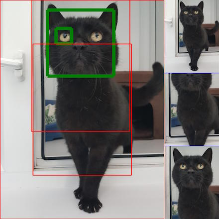

# Whiskers, Ears and Puppy Dog Tails: finding out what animal pictures are made of

This a collection of one of more presentations done illustrating the work I have
been collaborating with [Sky](https://twitter.com/carrotcodes) on to improve
images of Cats and Dogs on [Adopt Animals](https://www.adoptanimals.io/).

I tend not to record lots of details on the slides of presentations I create,
but instead focus on explaining on top of the slides, in the live presentation.
So, these slides *may* not be much use to you on their own.

However, I will endeavour to always include any useful links in the source of
the slides, even if I don't mention them explicitly in the talk itself. Also, if 
you have *seen* the talk and there was something I have mentioned which would be
useful, please mention it, and I will add it to the links.

## Presentation: PyData Edinburgh October 2018

Many thanks to [PyData Edinburgh](https://www.meetup.com/PyData-Edinburgh/) for letting me present at [PyData Edinburgh October 2018](https://www.meetup.com/PyData-Edinburgh/events/254843839/), and for everyone who attended.

See [markdown source](presentation.pydata_edi_2018.md) and resulting [pdf](presentation.pydata_edi_2018.pdf) exported from [Deckset](https://www.deckset.com/). The PDF captures the layout but does not contain the embedded videos.
