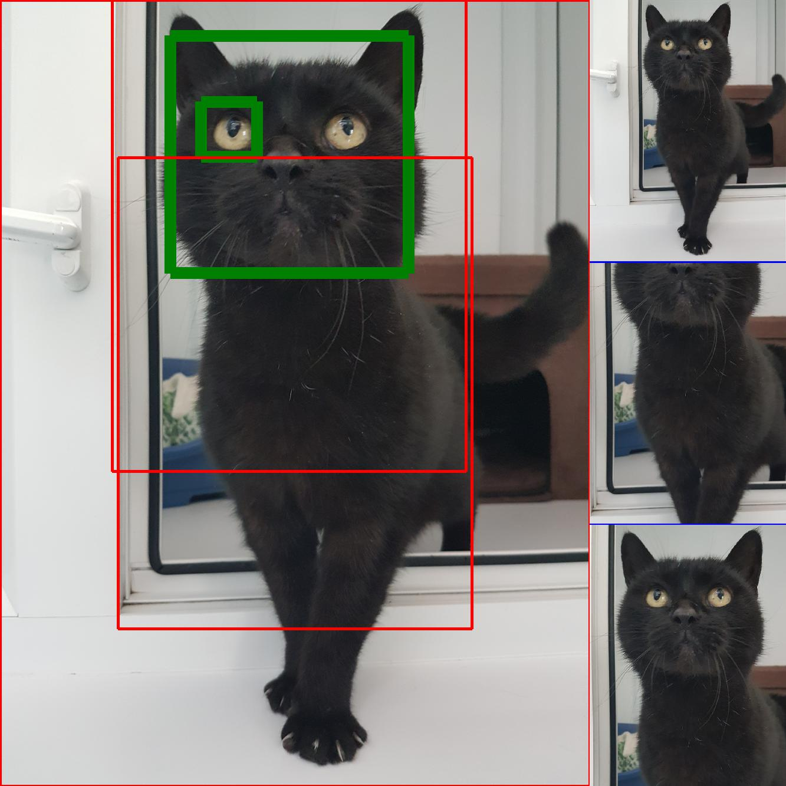
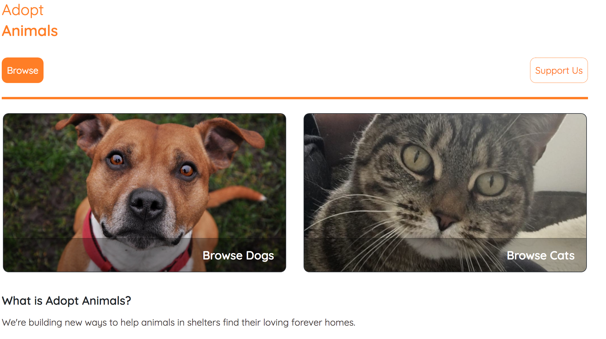
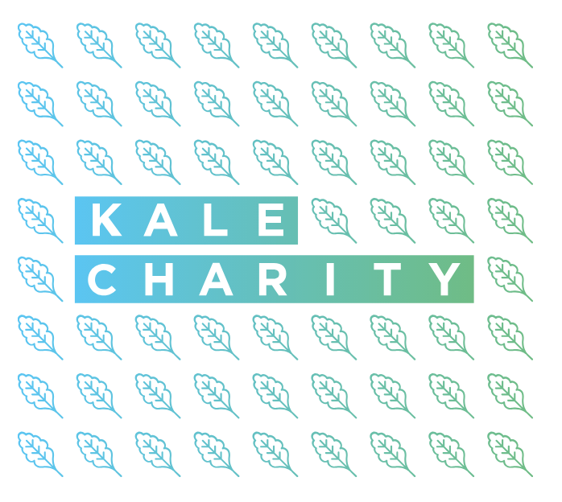
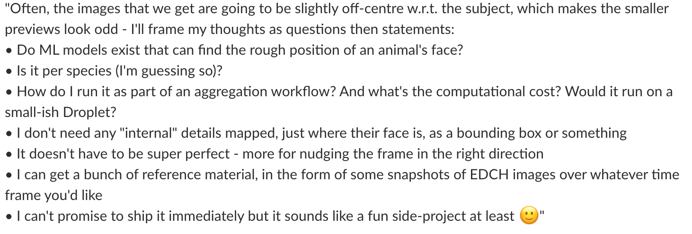
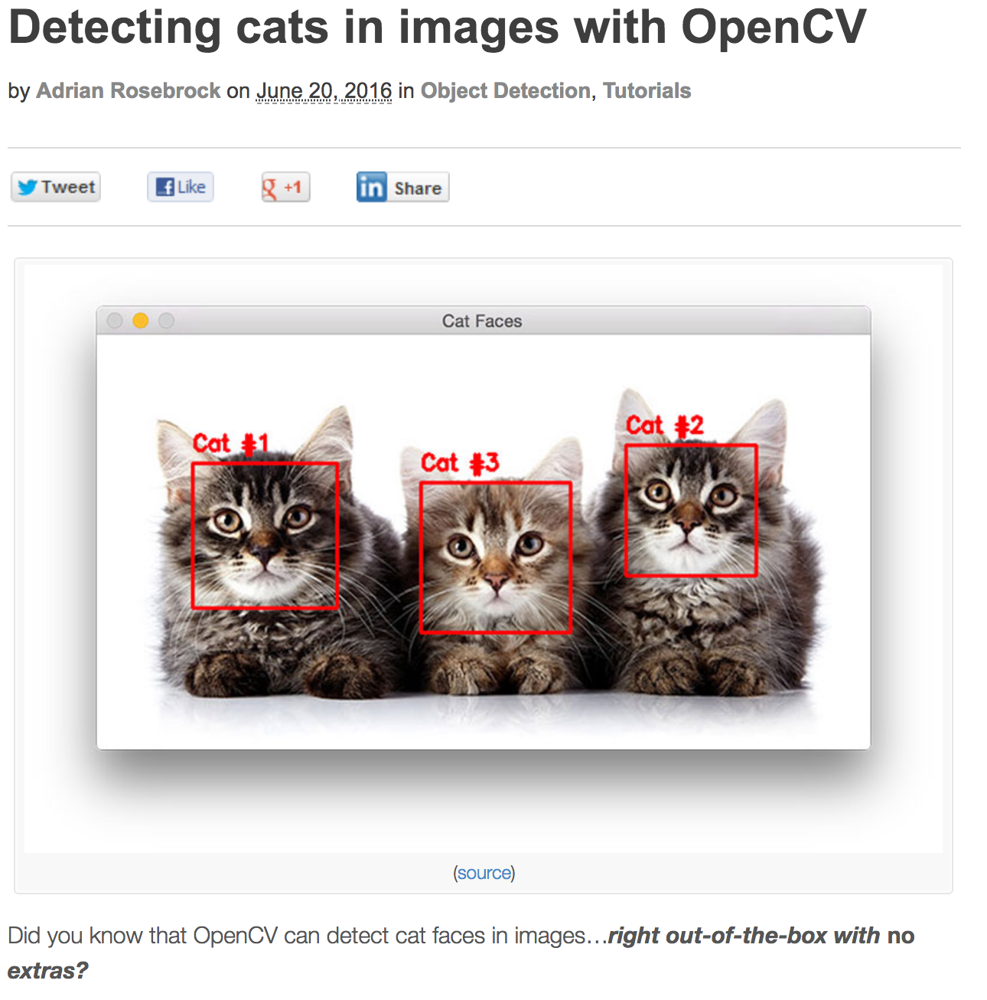
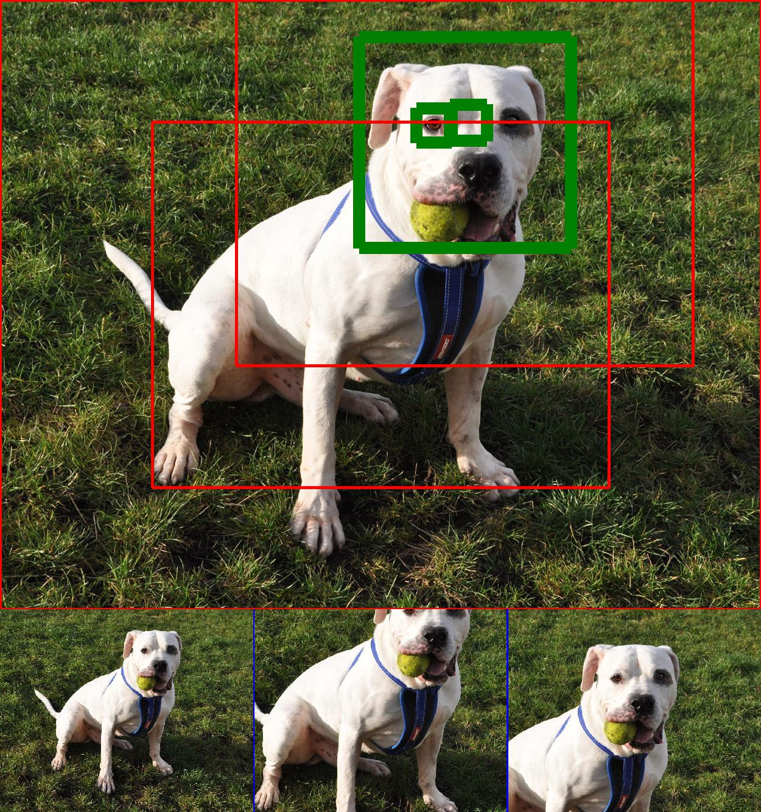
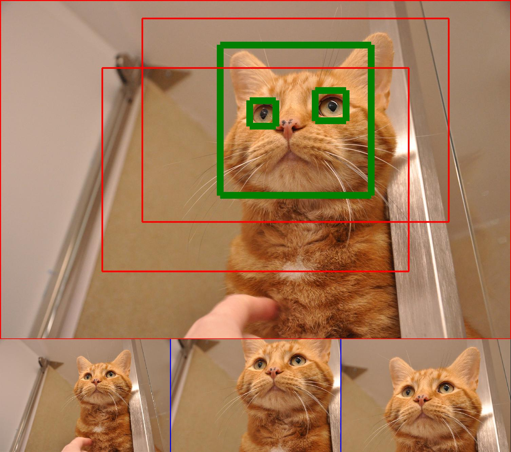
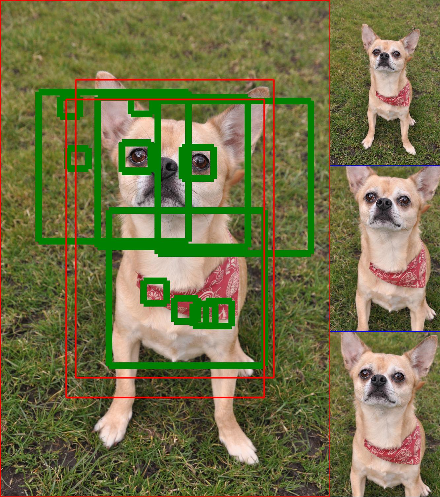
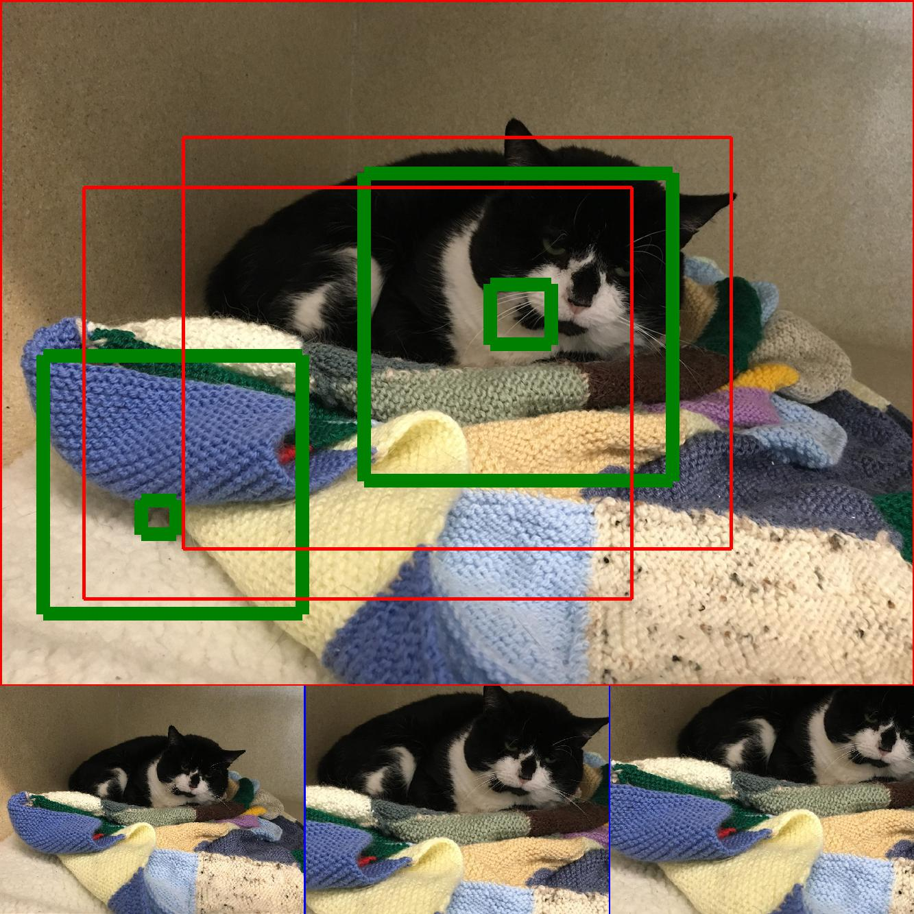

# Whiskers, Ears and Puppy Dog Tails: finding out what animal pictures are made of

---

# Who am I? Why am I doing this?

*  Mike Moran, Engineer at Skyscanner
* Adopt Animals
* Skyscanner “One Day”
* A general Machine Learning interest

---

# Context: Adopt Animals

— [Adopt Animals](https://www.adoptanimals.io/), by [Kale](https://www.kale.org.uk/) charity

---

# What were we trying to do?

— ([Sky](https://twitter.com/carrotcodes]) of Adopt Animals)

---

# My constraints

* I ~~am lazy~~ have limited time, so an off-the-shelf solution would be good
* I am *not* a Jupyter expert (yet?)
* I have a non-uniform experience of Data-science algorithms

---

# Ok, so how do I get to this?

---

# Going with something I know: Viola Jones face detection

— from [“Looking for Bobby but found Paris instead”](http://blog.houseofmoran.com/post/126043044893/looking-for-bobby-but-found-paris-instead)

---

# Training: Haar features

 

---

# Training: Adaboost

---

# Applying: Image Pyramid

* deals with varying feature size

---

# Applying: Integral Image

* efficiently evaluates hear features; O(n²) ➡ O(1)

---

# Applying: Haar cascade

---

# Visualising applying to image

[YouTube visualisation by Adam Harvey]()

---

# Re-using an off-the-shelf model

from [pyimagesearch](https://www.pyimagesearch.com/2016/06/20/detecting-cats-in-images-with-opencv/), using a pre-trained cat model from [Joseph Howse](https://twitter.com/CatsAndMonkeys)

---

# Where have I gotten to in this? Job done, ye?

---

# Not so fast

---

# Visualising varying min_size

---

# Learnings / Reinforcements

* Maybe *too* lazy in not focussing on understanding e.g. playing with scale-size instead of max-size parameters. Became clear once I actually spent some time on it.
* Some parameters still seem like magic (min neighbours = 5)
* You don't have to be an expert to be helpful

---

# Backing up: what next?

* Productionising the cats-only thumbnails
* Pre-learned Dogs?
* Auto-learning of parameters on top of same algorithm
* #HASHTAG DEEP LEARNING?
  * Deep learning is expensive, both in terms of cpu cost and collecting of training data, is it worth it?

---

# Thanks / Contact details / Questions

[Sky](https://twitter.com/carrotcodes]) of [Adopt Animals](https://www.adoptanimals.io/), https://twitter.com/carrotcodes

 [Kale Charity](https://www.kale.org.uk/), https://www.kale.org.uk/ 

 [(that’s me)](https://twitter.com/mike_moran), https://twitter.com/mike_moran

